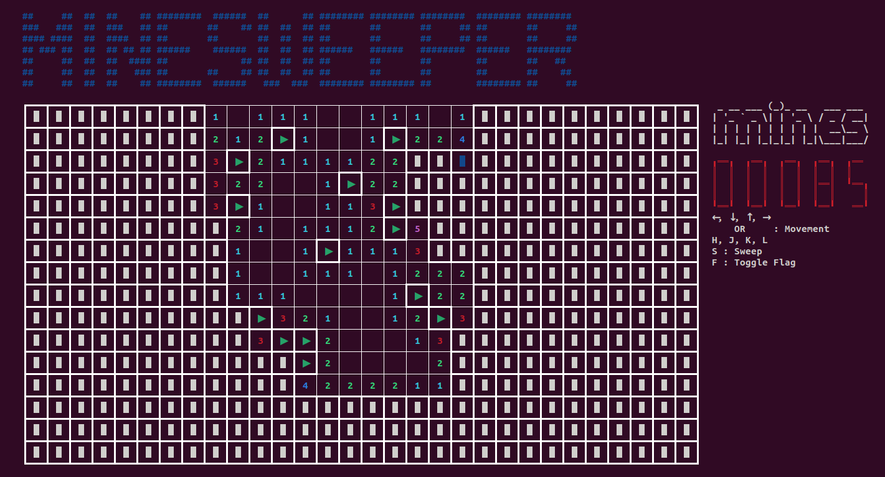

# Rust Minesweeper

A CLI implementation of Minesweeper, written in Rust. Based on the C++ version by [unknownblueguy6](https://github.com/unknownblueguy6/MineSweeper).



## Installation

1. Download the latest binary from the [Releases](https://github.com/alanzhu39/rust-minsweeper/releases) tab

2. Navigate to the downloaded binary

3. Execute binary
```
$ ./rust-minesweeper
```

## Contributing

### Prerequisites

* Rust v1.70+
* Cargo v1.70+

### Steps

1. Clone the repo

```
$ git clone https://github.com/alanzhu39/rust-minsweeper.git
$ cd rust-minesweeper
```

2. Build/run the program

* Build
```
$ cargo build
```

* Run
```
$ cargo run
```

## Authors

Alan Zhu
([LinkedIn](https://www.linkedin.com/in/alanzhu39/))

## Version History

* 0.1.0
    * Initial Release

## License

This project is distributed under the MIT License. See `LICENSE` for more information.

## Acknowledgments

* [Minesweeper](https://github.com/unknownblueguy6/MineSweeper): C++ command line version of Minesweeper
* [README Template](https://gist.github.com/DomPizzie/7a5ff55ffa9081f2de27c315f5018afc)
* [Getch Crate](https://docs.rs/getch/0.3.1/getch/): Rust library for detecting keyboard characters
